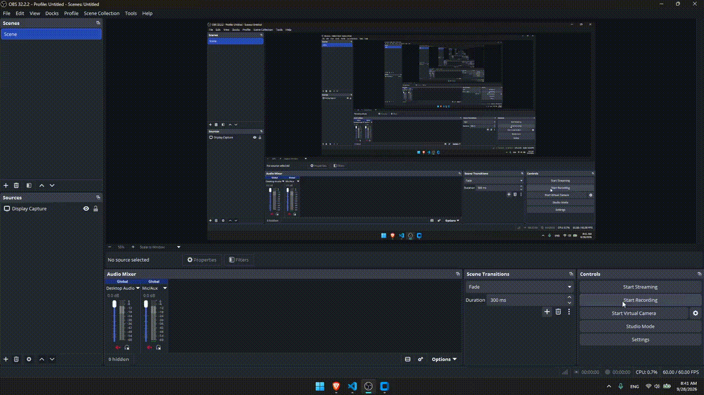
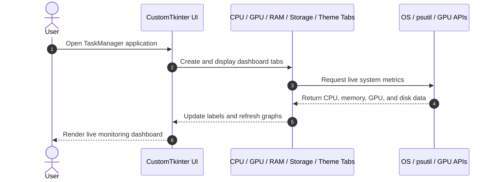

<div align="center">

# TaskManager

**A desktop system-monitoring dashboard that brings real-time CPU, GPU, RAM, and storage information into a clean Windows-inspired interface**

[](#)
[](https://github.com/TomSchimansky/CustomTkinter)
[](https://www.python.org/)
[](#-license--author)

</div>

---

<p align="center">
  
</p>

---

## 📌 Problem & Motivation

Monitoring system performance in a typical desktop environment often requires switching between multiple tools or relying on the built-in Windows Task Manager. Developers and users who want a lightweight, single-window overview of live device statistics need a clear and accessible interface.

**TaskManager** addresses this by consolidating the most important hardware and performance data into a single desktop dashboard:

- **Live system visibility:** Tracks the current status of the processor, memory, storage, and GPU in one place.
- **Fast diagnostics:** Exposes usage values, temperatures, capacities, and active system load without opening separate tools.
- **User-friendly control:** Includes a clean theme switcher for dark, light, and system-based appearance preferences.

---

## ✨ Key Features

- **⚡ Real-time CPU monitoring:** Displays utilization, current clock speed, physical and logical core counts, and a rolling utilization graph.
- **🎨 GPU insight panel:** Shows utilization with a live graph and reports temperature and VRAM when the active backend provides them.
- **💾 RAM usage metrics:** Monitors total, available, used memory, current percentage consumption, and a rolling usage graph.
- **🗂️ Storage overview:** Lists accessible partitions and reports total, used, free space, filesystem type, and usage percentage.
- **🌗 Theme customization:** Allows switching between dark, light, and system appearance modes.

CPU, RAM, and GPU views refresh once per second. The Storage tab refreshes partition usage every two seconds.

---

## 🧠 Architecture & How It Works



---

## 🛠️ Tech Stack

| Category | Technology | Purpose |
| --- | --- | --- |
| Frontend / Desktop UI | CustomTkinter | Modern desktop interface for the dashboard layout and controls |
| Core Language | Python 3.10+ | Main application logic and system monitoring |
| System Monitoring | psutil | Retrieves CPU, memory, and disk usage data |
| GPU Monitoring | `nvidia-smi` with Windows WMI fallback | Collects GPU usage and, when available, temperature and VRAM metrics |
| Charts | Matplotlib | Renders the CPU, GPU, and RAM history graphs |
| Windows Integration | WMI / pywin32 | Provides a generic GPU fallback on Windows |
| Target Platform | Windows 10 / 11 | Primary OS for the app experience and system integration |

---

## 🚀 Getting Started

### Prerequisites

- **Python:** 3.10 or newer
- **pip:** Python package manager
- **Windows 10/11:** Recommended platform for the full desktop experience

### 1. Install Python and pip

If Python is not installed on your computer, follow these steps:

1. Go to the official [Python website](https://www.python.org/downloads/).
2. Download the latest Python 3 version for Windows.
3. Run the installer.
4. Make sure to check the box that says: **Add Python to PATH**.
5. Click **Install Now**.
6. After installation completes, open **Command Prompt** and verify the installation:

```bash
python --version
pip --version
```

If both commands return a version number, Python and pip are installed correctly.

> If `python` is not recognized, try `py` instead:
>
> ```bash
> py --version
> ```

### 2. Create and activate a virtual environment

From the project directory, create a virtual environment named `.venv`:

```bash
python -m venv .venv
```

Activate it before installing dependencies or running the application.

**Windows PowerShell:**

```powershell
.\.venv\Scripts\Activate.ps1
```

**Windows Command Prompt:**

```bat
.venv\Scripts\activate.bat
```

When activation succeeds, `(.venv)` appears at the beginning of the terminal prompt. If PowerShell blocks the activation script, open PowerShell as your normal user and run this once:

```powershell
Set-ExecutionPolicy -ExecutionPolicy RemoteSigned -Scope CurrentUser
```

Then run the activation command again.

### 3. Install the project dependencies

```bash
git clone https://github.com/coxteen/TaskManager.git
cd TaskManager
python -m pip install --upgrade pip
python -m pip install -r requirements.txt
```

The `requirements.txt` file contains the exact package versions used by the project. Because the virtual environment is active, these packages are installed in `.venv` and do not change your global Python installation.

### 4. Running the App

```bash
python main.py
```

This launches the full desktop dashboard with CPU, GPU, RAM, Storage, and Theme tabs in the main window.

When you are finished, deactivate the virtual environment with:

```bash
deactivate
```

To work on the project again later, open a terminal in the project directory and activate `.venv` before running or installing anything.

The application is designed for Windows. NVIDIA GPU temperature and VRAM values require a working `nvidia-smi` installation. On other Windows GPU configurations, the app attempts to use WMI for utilization; unsupported values are displayed as unavailable.

### Project structure

| File | Responsibility |
| --- | --- |
| `main.py` | Creates the application and registers the five tabs |
| `window_factory.py` | Configures the CustomTkinter window and default theme |
| `system_metrics.py` | Collects metrics on a background thread and exposes thread-safe snapshots |
| `cpu_tab.py` | CPU metrics and utilization chart |
| `gpu_tab.py` | GPU metrics and utilization/temperature charts |
| `ram_tab.py` | Memory metrics and usage chart |
| `storage_tab.py` | Accessible partition list and capacity details |
| `theme_tab.py` | Dark, light, and system appearance controls |

---

## ⚙️ Configuration

The default appearance and window settings are defined in `window_factory.py`:

```python
import customtkinter as ctk

ctk.set_appearance_mode("dark")
ctk.set_default_color_theme("blue")
```

The Theme tab changes the appearance mode at runtime. Edit `window_factory.py` to change the default mode, color theme, title, initial size, or minimum size.

---

## 📄 License & Author

- **Author:** Costin Ghiujan ([`@coxteen`](https://github.com/coxteen))
- **License:** Released under the [MIT License](LICENCE)


