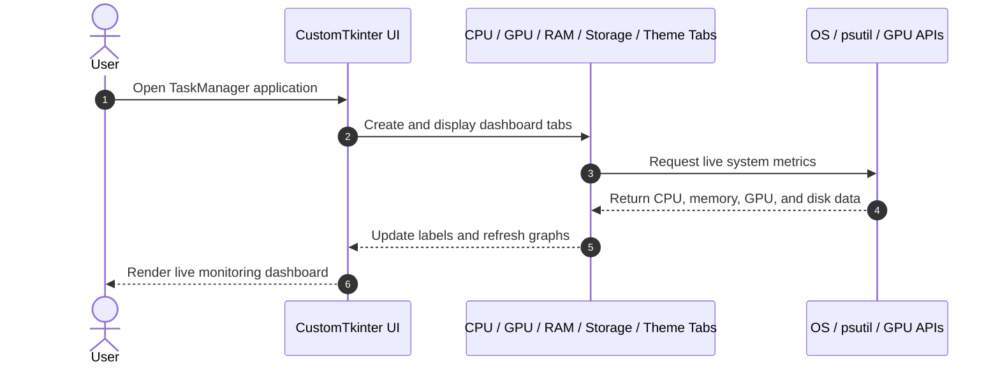

<div align="center">

# 🚀 TaskManager

**A desktop system-monitoring dashboard that brings real-time CPU, GPU, RAM, and storage information into a clean Windows-inspired interface.**

[](#)
[](https://github.com/TomSchimansky/CustomTkinter)
[](https://www.python.org/)
[](#-license--author)

[Overview](#-problem--motivation) · [Getting Started](#-getting-started) · [Contributing](#-contributing)

</div>

---

<p align="center">
  
</p>

---

## 📌 Problem & Motivation

Monitoring system performance in a typical desktop environment often requires switching between multiple tools or relying on the built-in Windows Task Manager, which is not always convenient for quick, focused inspection. Developers and users who want a lightweight, single-window overview of live device statistics need a clear and accessible interface.

**TaskManager** addresses this by consolidating the most important hardware and performance data into a single desktop dashboard:

- **Live system visibility:** Tracks the current status of the processor, memory, storage, and GPU in one place.
- **Fast diagnostics:** Exposes usage values, temperatures, capacities, and active system load without opening separate tools.
- **User-friendly control:** Includes a clean theme switcher for dark, light, and system-based appearance preferences.

---

## ✨ Key Features

- **⚡ Real-time CPU monitoring:** Displays the processor model, current utilization, clock speed, active processes, core count, and uptime.
- **🎨 GPU insight panel:** Shows utilization, temperature, and memory usage with live graph updates for quick performance tracking.
- **💾 RAM usage metrics:** Monitors total, available, used memory and current percentage consumption.
- **🗂️ Storage overview:** Lists detected drives and reports total, used, free space, and usage percentage.
- **🌗 Theme customization:** Allows switching between dark, light, and system appearance modes.

---

## 🧠 Architecture & How It Works



---

## 🛠️ Tech Stack

| Category | Technology | Purpose |
| --- | --- | --- |
| Frontend / Desktop UI | CustomTkinter | Modern desktop interface for the dashboard layout and controls |
| Core Language | Python 3.10+ | Main application logic and system monitoring |
| System Monitoring | psutil | Retrieves CPU, memory, and disk usage data |
| GPU Monitoring | NVIDIA System Management Interface (nvidia-smi) | Collects GPU usage, temperature, and memory metrics |
| Extra Utilities | screeninfo, matplotlib, py-cpuinfo | Window sizing, graph rendering, and CPU metadata |
| Target Platform | Windows 10 / 11 | Primary OS for the app experience and system integration |

---

## 🚀 Getting Started

### Prerequisites

- **Python:** 3.10 or newer
- **pip:** Python package manager
- **Windows 10/11:** Recommended platform for the full desktop experience

### 1. Install Python and pip

If Python is not installed on your computer, follow these steps:

1. Go to the official [Python website](https://www.python.org/downloads/).
2. Download the latest Python 3 version for Windows.
3. Run the installer.
4. Make sure to check the box that says: **Add Python to PATH**.
5. Click **Install Now**.
6. After installation completes, open **Command Prompt** and verify the installation:

```bash
python --version
pip --version
```

If both commands return a version number, Python and pip are installed correctly.

> If `python` is not recognized, try `py` instead:
>
> ```bash
> py --version
> ```

### 2. Install the project dependencies

```bash
git clone https://github.com/coxteen/TaskManager.git
cd TaskManager
pip install customtkinter screeninfo psutil py-cpuinfo matplotlib
```

### 3. Running the App

```bash
python main.py
```

This launches the full desktop dashboard with all tabs available in the main window.

---

## ⚙️ Configuration

The main appearance settings are defined in the app startup and theme files:

```python
import customtkinter as ctk

ctk.set_appearance_mode("dark")
ctk.set_default_color_theme("blue")
```

These values can be adjusted in `create_window.py` and `theme_tab.py` to modify the default theme behavior, colors, and window sizing.

---

## 🗺️ Roadmap & Known Issues

- [x] CPU, GPU, RAM, and storage monitoring tabs
- [x] Theme switching between dark, light, and system modes
- [x] Real-time UI refresh for core metrics
- [ ] Improve compatibility for non-NVIDIA GPUs
- [ ] Add better error handling for unsupported hardware or missing metrics
- [ ] Expand the interface with more detailed charts and filtering options

---

## 🤝 Contributing

Contributions, improvements, and feature suggestions are welcome.

1. Fork the project.
2. Create your feature branch (`git checkout -b feature/AmazingFeature`).
3. Commit your changes (`git commit -m 'feat: Add AmazingFeature'`).
4. Push to the branch (`git push origin feature/AmazingFeature`).
5. Open a Pull Request.

---

## 📄 License & Author

- **Author:** Costin Ghiujan ([`@coxteen`](https://github.com/coxteen))
- **License:** Released under the [MIT License](https://opensource.org/licenses/MIT)


